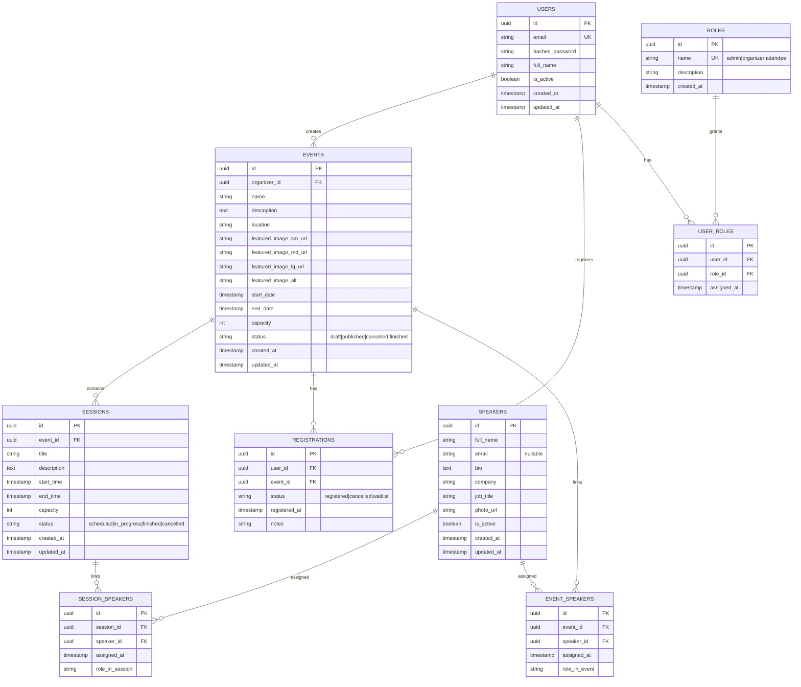

# Documento de entrega:

## Guía para desarrollar el proyecto "Prueba técnica Desarrollador Backend" para tusdatos.co

Este documento es mi guía personal para construir y entregar el MVP de la aplicación Web FullStack para **Mis Eventos**, como parte de la prueba técnica para la vacante de Desarrollador Python. 
Mi foco es una sola entrega funcional y sólida.

---
## Documentación 

- API Doc: [http://localhost:8000/docs](http://localhost:8000/docs)
- Manual de usuario: [http://localhost:5173/manual](http://localhost:5173/manual)
- Documento de entrega versión Web: [http://localhost:5173/source](http://localhost:5173/source)

---
### Contexto del requerimiento

**Cliente:** Mis Eventos.  
**Problema real:** hoy manejan eventos de forma manual y eso les genera desorden, errores y pérdida de tiempo.

#### Soluciones propuestas para resolver el problema

- centralizar la gestión de eventos.
- permitir registro/login de usuarios.
- permitir inscripciones a eventos con control de cupos.
- organizar sesiones por evento.
- dar visibilidad clara al usuario sobre sus inscripciones.

---
## Alcance

### Funcionalidades a entregar

- autenticación JWT (`register`, `login`, `me`).
- CRUD completo de eventos.
- búsqueda por nombre y paginación de eventos.
- gestión de sesiones por evento.
- inscripción de usuarios a eventos.
- consulta de eventos inscritos por usuario.
- gestión de usuarios y roles desde perfil admin.
- validaciones críticas de negocio.
- Swagger disponible.
- ejecución con Docker Compose.
- pruebas mínimas de backend y frontend.

---
### Flujos de usuario, permisos y componentes

Esta sección define la navegación, componentes compartidos y permisos por rol para el MVP.

#### Reglas globales

- Tipos de usuario: visitante (sin login), `attendee`, `organizer`, `admin`.
- El registro crea usuarios con rol por defecto `attendee`.
- La consulta de eventos y detalle es pública; la inscripción requiere autenticación.
- La inscripción solo se habilita si hay cupos disponibles y no existe inscripción previa del mismo usuario.
- Los ítems del menú lateral y las acciones visibles cambian según el rol (RBAC).

#### Componentes compartidos

1. Menú lateral:
   - Renderiza opciones de navegación según rol.
2. Inicio:
   - Botón `Ver todos los eventos` que redirige a `Eventos`.
   - Carrusel de los últimos 12 eventos.
   - El carrusel se pausa al pasar el cursor.
   - Cada tarjeta incluye botón `Ver detalles`.
3. Eventos:
   - Buscador por nombre o coincidencia parcial.
   - Filtro por fecha.
   - Grid de eventos con paginación.
   - Cada tarjeta incluye botón `Ver detalle`.
4. Detalle de evento:
   - Muestra: nombre, imagen destacada, texto alternativo, fecha, organizador, ubicación, descripción, capacidad y sesiones.
   - Sesiones con: horario, estado y ponentes asignados.
   - Botón `Volver a eventos`.
5. ¿Soy oferente?:
   - Buscador por nombre o coincidencia parcial.
   - Devuelve coincidencias donde el oferente esté agendado: evento, fecha y sesión.
   - Botón `Ver evento`.
6. Autenticación:
   - Formularios de `Iniciar sesión` y `Registrarme`.
   - Acción `Salir` para cerrar sesión.

#### Flujo por tipo de usuario

##### 1. Usuario visitante (sin autenticación)

- Menú lateral: `Inicio`, `Eventos`, `¿Soy oferente?`, `Acceder`.
- En `Inicio`: ve carrusel, botón `Ver todos los eventos` y botón `Iniciar sesión`.
- En `Eventos`: puede buscar, filtrar, paginar y abrir detalle.
- En `Detalle de evento`: ve botón para iniciar sesión y poder inscribirse.
- `Acceder` abre menú flotante con: `Iniciar sesión`, `Registrarme`, `¿Soy oferente?`.

##### 2. Usuario autenticado con rol `attendee`

- Menú lateral: `Inicio`, `Eventos`, `¿Soy oferente?`, `Mi perfil`, `Salir`.
- En `Inicio`: saludo personalizado, carrusel y acceso a eventos.
- En `Eventos` y `Detalle de evento`: puede consultar e inscribirse si hay capacidad.
- En `Mi perfil`:
  - Puede editar nombre y contraseña (validando contraseña actual).
  - Ve `Agenda de eventos` con sus eventos inscritos y acceso al detalle.
- `Salir` cierra la sesión.

##### 3. Usuario autenticado con rol `organizer`

- Menú lateral: `Inicio`, `Eventos`, `¿Soy oferente?`, `Crear evento`, `Mi perfil`, `Salir`.
- Hereda todas las capacidades de `attendee`.
- En `Crear evento`: puede crear eventos con nombre, fecha, ubicación, capacidad, estado, imagen destacada, texto alternativo y descripción.
- En `Eventos` y `Detalle de evento`:
  - Si es creador del evento: `Editar evento`, `Eliminar evento`, `Crear sesión`, `Ver sesión` y `Editar sesión`.
  - Si no es creador: mantiene acciones de consulta e inscripción según reglas.
- En `Mi perfil`:
  - Datos personales (nombre y contraseña).
  - `Eventos organizados por mí`.
  - `Agenda de eventos`.

##### 4. Usuario autenticado con rol `admin`

- Menú lateral: `Inicio`, `Eventos`, `¿Soy oferente?`, `Métricas`, `Crear evento`, `Mi perfil`, `Salir`.
- Hereda capacidades de `attendee` y `organizer`.
- Tiene control global sobre eventos y sesiones:
  - Crear, editar y eliminar cualquier evento.
  - Crear, ver y editar sesiones de cualquier evento.
- En `Métricas`: visualiza indicadores y resumen de datos relevantes de eventos.
- En `Mi perfil`:
  - Datos personales (nombre y contraseña).
  - `Eventos organizados por mí`.
  - `Agenda de eventos`.
  - `Gestión de usuarios`: lista de usuarios y cambio de rol.
  - `Todos los eventos`: listado global con filtros por nombre, fecha, estado, organizador y orden (alfabético/fecha).
- `Salir` cierra la sesión.

#### Matriz resumida de permisos

| Módulo / Acción | Visitante | `attendee` | `organizer` | `admin` |
|---|---|---|---|---|
| Ver inicio, eventos y detalle | Sí | Sí | Sí | Sí |
| Inscribirse a evento | No | Sí | Sí | Sí |
| Consultar `¿Soy oferente?` | Sí | Sí | Sí | Sí |
| Editar perfil (nombre/contraseña) | No | Sí | Sí | Sí |
| Crear evento | No | No | Sí | Sí |
| Editar/eliminar evento propio | No | No | Sí | Sí |
| Editar/eliminar cualquier evento | No | No | No | Sí |
| Gestionar sesiones | No | No | Solo en eventos propios | Sí |
| Ver métricas | No | No | No | Sí |
| Gestionar usuarios y roles | No | No | No | Sí |

---
## Reglas de negocio

- no permitir inscripciones por encima de la capacidad del evento.
- no permitir inscripción duplicada del mismo usuario al mismo evento.
- no permitir eventos con fechas inválidas.
- no permitir sesiones con horarios inválidos.
- no permitir sesiones fuera del rango del evento.
- no permitir cambiar un usuario a `attendee` si ya creó eventos.
- el admin principal configurado (`madebygarzon@gmail.com`) no puede perder rol `admin`.

---
## Variables de entorno reales (MVP)

Esta sección centraliza los valores reales que uso en desarrollo para los `.env`.

### Root (`/.env`)

Estas variables son referencia para base de datos local; en Docker Compose el servicio `db` ya define estos valores explícitamente.

| Variable | Valor real | Corresponde a |
|---|---|---|
| `POSTGRES_DB` | `mis_eventos` | Nombre de la base PostgreSQL |
| `POSTGRES_USER` | `postgres` | Usuario de PostgreSQL |
| `POSTGRES_PASSWORD` | `postgres` | Contraseña de PostgreSQL |
| `DATABASE_URL` | `postgresql+psycopg://postgres:postgres@db:5432/mis_eventos` | URL de conexión backend -> DB |

### Backend (`/backend/.env`)

| Variable | Valor real | Corresponde a |
|---|---|---|
| `APP_NAME` | `Mis Eventos API` | Nombre de la aplicación FastAPI |
| `API_V1_PREFIX` | `/api/v1` | Prefijo base de rutas API |
| `SECRET_KEY` | `replace_with_a_strong_random_secret` | Firma de JWT |
| `ALGORITHM` | `HS256` | Algoritmo JWT |
| `ACCESS_TOKEN_EXPIRE_MINUTES` | `60` | Minutos de vigencia del token |
| `DATABASE_URL` | `postgresql+psycopg://postgres:postgres@db:5432/mis_eventos` | Conexión a PostgreSQL |
| `BACKEND_CORS_ORIGINS` | `http://localhost:5173,http://127.0.0.1:5173` | Orígenes permitidos para frontend |
| `REDIS_URL` | `redis://redis:6379/0` | URL de conexión a Redis para caché de lecturas |
| `CACHE_TTL_SECONDS` | `60` | Tiempo de vida (TTL) en segundos para caché en Redis |
| `ADMIN_EMAIL` | `madebygarzon@gmail.com` | Usuario admin principal del sistema |

### Frontend (`/frontend/.env`)

| Variable | Valor real | Corresponde a |
|---|---|---|
| `VITE_API_BASE_URL` | `http://localhost:8000/api/v1` | URL base del backend consumida por el cliente React |

---
## Paso a paso para correr el proyecto localmente

Esta sección está pensada para una persona que descarga el repositorio por primera vez.

### Opción recomendada: Docker Compose

1. Clonar el repositorio y entrar a la carpeta del proyecto:

```bash
git clone https://github.com/madebygarzon/misEventos.git
cd misEventos
```

2. Crear archivos de entorno desde los ejemplos:

```bash
cp .env.example .env
cp backend/.env.example backend/.env
cp frontend/.env.example frontend/.env
```

3. Levantar servicios:

```bash
docker compose up --build -d
```

4. Confirmar que `backend` esté en ejecución (requerido para migrar):

```bash
docker compose ps
```

Si `backend` no aparece `Up`, revisar:

```bash
docker compose logs --tail=120 backend
```

5. Aplicar migraciones:

```bash
docker compose exec backend alembic upgrade head
docker compose exec backend alembic current
```

Resultado esperado en `alembic current`:
- `0010_create_event_speakers (head)`

6. Cargar datos demo:

```bash
docker compose exec -T db psql -U postgres -d mis_eventos < docs/seed.sql
```

Credencial demo admin:
- email: `madebygarzon@gmail.com`
- password: `password123`

7. Verificar estado de contenedores:

```bash
docker compose ps
```

8. Abrir la aplicación:

- Frontend: `http://localhost:5173`
- Backend: `http://localhost:8000`
- Swagger: `http://localhost:8000/docs`

9. Validar que Redis está operativo:

```bash
docker compose exec redis redis-cli ping
```

Respuesta esperada: `PONG`.

### Opción alternativa: ejecución local sin Docker

Precondiciones:

- Python 3.12
- Poetry
- Node.js 20+
- npm
- PostgreSQL 16+
- Redis 7+

1. Configurar variables de entorno:

```bash
cp backend/.env.example backend/.env
cp frontend/.env.example frontend/.env
```

2. Backend:

```bash
cd backend
poetry install
poetry run alembic upgrade head
poetry run alembic current
poetry run uvicorn app.main:app --reload --host 0.0.0.0 --port 8000
```

3. Frontend (en otra terminal):

```bash
cd frontend
npm install
npm run dev
```

4. Abrir:

- Frontend: `http://localhost:5173`
- Backend: `http://localhost:8000`
- Swagger: `http://localhost:8000/docs`

---
### Modelo base de datos



> Nota de negocio vigente: el flujo activo usa ponentes por sesión (`session_speakers`).  
> La tabla `event_speakers` existe por evolución de esquema, pero la asociación global de ponentes a evento está deshabilitada en la lógica actual.

#### Reglas de integridad

- `users.email` único.
- `events.capacity > 0`.
- `events.organizer_id` referencia `users.id`.
- `sessions.event_id` referencia `events.id`.
- `registrations.user_id` referencia `users.id`.
- `registrations.event_id` referencia `events.id`.
- `events.start_date < events.end_date`.
- `sessions.start_time < sessions.end_time`.
- sesión dentro del rango del evento.
- `registrations` único por `(user_id, event_id)`.
- `session_speakers` único por `(session_id, speaker_id)`.
- `event_speakers` único por `(event_id, speaker_id)`.
- `roles.name` único.
- `user_roles` único por `(user_id, role_id)`.
- `speakers` no depende de `users` (ponente no necesita cuenta).
- en la lógica actual, al actualizar rol desde administración dejo un solo rol activo por usuario.

#### Índices

- `events(name)`.
- `events(status)`.
- `events(organizer_id)`.
- `sessions(event_id)`.
- `sessions(status)`.
- `registrations(event_id)`.
- `registrations(user_id)`.
- `roles(name)`.
- `user_roles(user_id, role_id)` único.
- `speakers(full_name)`.
- `speakers(email)`.
- `session_speakers(session_id)`.
- `session_speakers(speaker_id)`.
- `event_speakers(event_id)`.
- `event_speakers(speaker_id)`.

---
### Arquitectura para esta entrega

Voy a construir un **monolito modular** porque me permite entregar rápido, con menos riesgo y con buena calidad. Priorizo entrega, mantenibilidad y criterio. 

#### Cómo lo voy a organizar

Módulos:

- `auth`
- `users`
- `events`
- `sessions`
- `speakers`
- `registrations`

Capas por módulo:

- `api` para HTTP.
- `service` para reglas de negocio.
- `repository` para acceso a datos.
- `models/schemas` para entidades y contratos.

Elegí un monolito modular porque el alcance de la prueba no justifica una arquitectura distribuida. Esta decisión me permite entregar más rápido, reducir complejidad operativa y mantener una base técnica limpia.
Lo estructuré por módulos de negocio como auth, users, events, sessions, speakers y registrations, lo que facilita la mantenibilidad y la evolución del sistema.
Dentro de cada módulo separé responsabilidades en capas: api para exposición HTTP, service para reglas de negocio, repository para persistencia y models/schemas para entidades y contratos.
Con esto logro un sistema simple de desplegar, fácil de probar y suficientemente escalable para el contexto de la prueba.

---
### Cómo aplicaré SOLID en la práctica

#### S — Responsabilidad única

- Estado actual:
  - `service` concentra reglas de negocio.
  - `repository` hace persistencia.
  - La capa `api` coordina request/response en casi todos los módulos.
- Ajuste pendiente identificado:
  - En `events`, la función de mapeo de respuesta hace consultas adicionales (organizador e inscritos).  
    Para cumplir SRP de forma estricta, debo mover ese armado enriquecido al `service` o a un assembler dedicado.

#### O — Abierto/cerrado

- Estado actual:
  - El sistema se extiende creando nuevos módulos/servicios/endpoints (ejemplo: métricas) sin romper flujos existentes.
  - No tengo bloques grandes de `if/else` en controladores.
- Decisión:
  - Mantengo este principio como cumplido para el alcance MVP.

#### L — Sustitución

- Estado actual:
  - No estoy usando jerarquías complejas ni herencia polimórfica relevante.
  - El principio no está violado, pero tampoco es un eje fuerte en esta versión.
- Decisión:
  - Lo mantengo controlado para MVP y lo profundizaré si introduzco contratos formales de repositorio.

#### I — Segregación de interfaces

- Estado actual:
  - Separé responsabilidades por módulo y por capa.
  - No definí interfaces/puertos formales por caso de uso (lectura/escritura).
- Ajuste pendiente identificado:
  - Si evoluciona el proyecto, debo introducir contratos explícitos para evitar depender de repositorios “grandes”.

#### D — Inversión de dependencias

- Estado actual:
  - Sí uso inyección de dependencias (los servicios reciben repositorios por constructor).
  - Pero los servicios dependen de clases concretas de repositorio, no de abstracciones.
- Ajuste pendiente identificado:
  - Para cumplir DIP en estricto, debo definir interfaces (protocolos/ABC) y tipar los servicios contra esas abstracciones.

#### Anti-patrones evitados

- controladores con lógica de negocio.
- servicios ejecutando SQL directo.
- repositorios ocultando reglas de negocio.
- acoplar lógica de dominio a detalles del framework.

---
## Stack a usar

### Backend

- FastAPI
- SQLModel
- PostgreSQL
- Alembic
- Poetry
- pytest

### Frontend

- React + Vite
- React Router
- Zustand
- Axios
- Vitest

### Infra

- Docker
- Docker Compose

---
## Checklist final de cumplimiento (requisito -> implementación)

### Backend técnico

- **Python 3.12** -> `Cumplido` (`python:3.12` en Dockerfile backend).
- **FastAPI o Flask** -> `Cumplido` (FastAPI).
- **SQLAlchemy + SQLModel (o Core)** -> `Cumplido` (SQLModel sobre SQLAlchemy).
- **PostgreSQL** -> `Cumplido` (servicio `db` en Docker Compose).
- **Poetry** -> `Cumplido` (backend gestionado con Poetry).
- **Alembic** -> `Cumplido` (migraciones versionadas y aplicables).
- **Tests unitarios (pytest)** -> `Cumplido` (suite backend para auth/eventos/sesiones/inscripciones/usuarios/ponentes).
- **Swagger/OpenAPI** -> `Cumplido` (`/docs` activo en FastAPI).

### Frontend técnico

- **React, Vue o Angular** -> `Cumplido` (React + Vite).
- **Router** -> `Cumplido` (React Router).
- **Manejador de estado** -> `Cumplido` (Zustand).
- **Peticiones HTTP** -> `Cumplido` (Axios).
- **Tests unitarios** -> `Cumplido` (Vitest configurado y pruebas en frontend).

### Entorno

- **Docker + Docker Compose** -> `Cumplido` (servicios backend/frontend/db).
- **Variables de entorno** -> `Cumplido` (`.env` y `.env.example` por servicio + valores reales centralizados en `docs/structured_project.md`).

### Optimización y calidad

- **Optimización de imágenes** -> `Cumplido` (WebP + compresión + variantes por tamaño).
- **Lazy loading** -> `Pendiente` (rutas actuales cargan de forma directa; falta `React.lazy` + `Suspense`).
- **Minificación de código** -> `Cumplido` (build de producción con Vite).
- **Caching** -> `Parcial` (no hay capa explícita de caché de datos; se usa comportamiento estándar del cliente/navegador).
- **Linting** -> `Parcial` (ESLint en frontend y Ruff en backend; no está Black integrado).
- **Testing** -> `Cumplido` (pytest backend + Vitest frontend).

### UI/UX mínimo a cumplir

- diseño limpio, usable y consistente -> `Cumplido`.
- responsive en móvil/tablet/desktop -> `Cumplido`.
- loading states (spinner/skeleton) en vistas con carga -> `Cumplido`.
- feedback visual para acciones: éxito/error/validación -> `Cumplido`.

---
## Pruebas (guía de ejecución para la entrega)

### Objetivo

Esta sección define cómo ejecuto y valido las pruebas del MVP antes de entregar.

### Herramientas

- Backend: `pytest` (con `poetry`).
- Frontend: `Vitest`.
- Ejecución recomendada: contenedores con `Docker Compose`.

### Alcance de pruebas

- Backend:
  - autenticación (`auth`)
  - eventos (`events`)
  - sesiones (`sessions`)
  - inscripciones (`registrations`)
  - ponentes (`speakers`)
  - usuarios y roles (`users`)
- Frontend:
  - pruebas unitarias/componentes clave de páginas principales.

### Precondiciones

- Docker Desktop ejecutándose.
- Servicios levantados desde raíz del proyecto:

```bash
docker compose up -d
```

- Migraciones aplicadas:

```bash
docker compose exec backend alembic upgrade head
```

### Paso a paso recomendado (Docker)

1. Levantar contenedores:

```bash
docker compose up -d
```

2. Instalar dependencias de desarrollo del backend:

```bash
docker compose exec backend poetry install --with dev
```

3. Aplicar migraciones:

```bash
docker compose exec backend alembic upgrade head
```

4. Ejecutar tests de backend:

```bash
docker compose exec backend poetry run pytest -q
```

5. Ejecutar tests de frontend:

```bash
docker compose exec frontend npm run test
```

### Comandos de pruebas (Docker)

Backend:

```bash
docker compose exec backend poetry run pytest -q
```

Frontend:

```bash
docker compose exec frontend npm run test
```

Resultado esperado (referencia de esta entrega):

- Backend: `33 passed`
- Frontend: `2 passed`

### Comandos de pruebas (ejecución local sin Docker)

Backend:

```bash
cd backend
poetry install
poetry run alembic upgrade head
poetry run pytest -q
```

Frontend:

```bash
cd frontend
npm install
npm run test
```

### Troubleshooting rápido

- Error: `Command not found: pytest`
  - Ejecutar:

```bash
docker compose exec backend poetry install --with dev
```

- Error: `no such table: ...`
  - Ejecutar migraciones:

```bash
docker compose exec backend alembic upgrade head
```

- Warnings en frontend (`React Router Future Flag`, `act(...)`, `AggregateError` en jsdom)
  - No bloquean la entrega si el resumen final indica tests en verde.

### Linting útil para acompañar la entrega

Backend:

```bash
cd backend
poetry run ruff check .
```

Frontend:

```bash
cd frontend
npm run lint
```

### Criterio de aceptación para esta entrega

- Backend: suite `pytest` pasando completamente.
- Frontend: suite `vitest` pasando completamente.
- Errores de test: `0`.
- Warnings no bloqueantes: permitidos si no afectan resultado funcional (dejo evidencia en logs si aparecen).

---
## API final construida

### Auth

- `POST /api/v1/auth/register`
- `POST /api/v1/auth/login`
- `GET /api/v1/auth/me`

### Events

- `GET /api/v1/events`
- `GET /api/v1/events/{id}`
- `POST /api/v1/events`
- `PUT /api/v1/events/{id}`
- `DELETE /api/v1/events/{id}`

Filtros:

- `search`
- `page`
- `limit`
- `status`

### Sessions

- `GET /api/v1/events/{event_id}/sessions`
- `POST /api/v1/events/{event_id}/sessions`
- `PUT /api/v1/sessions/{id}`
- `DELETE /api/v1/sessions/{id}`

### Registrations

- `POST /api/v1/events/{event_id}/register`
- `GET /api/v1/users/me/registrations`
- `DELETE /api/v1/events/{event_id}/register`

### Users

- `PATCH /api/v1/users/me`

### Users (admin)

- `GET /api/v1/users`
- `PATCH /api/v1/users/{user_id}/role`

### Speakers

- `GET /api/v1/speakers`
- `GET /api/v1/speakers/{speaker_id}`
- `POST /api/v1/speakers`
- `PUT /api/v1/speakers/{speaker_id}`
- `DELETE /api/v1/speakers/{speaker_id}`
- `GET /api/v1/sessions/{session_id}/speakers`
- `POST /api/v1/sessions/{session_id}/speakers/{speaker_id}`
- `DELETE /api/v1/sessions/{session_id}/speakers/{speaker_id}`
- `GET /api/v1/events/{event_id}/speakers`
- `POST /api/v1/events/{event_id}/speakers/{speaker_id}`
- `DELETE /api/v1/events/{event_id}/speakers/{speaker_id}`

> Nota funcional vigente: la asignación directa de ponentes a evento está bloqueada por regla de negocio.  
> Los endpoints de `POST/DELETE` sobre `/events/{event_id}/speakers/{speaker_id}` responden error de negocio; la asignación válida es por sesión.

### Uploads

- `POST /api/v1/uploads/events/featured-image`

### Metrics (admin)

- `GET /api/v1/metrics/summary`

Filtros:

- `start_date`
- `end_date`
- `event_status`
- `organizer_id`

### Health

- `GET /health`

---
## Estructura del repositorio a seguir

```txt
misEventos/
├── backend/
│   ├── alembic/
│   │   ├── env.py
│   │   └── versions/
│   ├── app/
│   │   ├── api/
│   │   │   └── v1/
│   │   ├── core/
│   │   ├── models/
│   │   ├── repositories/
│   │   ├── schemas/
│   │   ├── services/
│   │   ├── tests/
│   │   └── main.py
│   ├── media/
│   │   └── events/
│   ├── alembic.ini
│   ├── pyproject.toml
│   ├── poetry.lock
│   ├── Dockerfile
│   └── README.md
├── docs/
│   ├── Prueba técnica Desarrollador Backend.md
│   ├── Prueba Técnica  - Desarrollador Backend (1).pdf
│   └── structured_project.md
├── frontend/
│   ├── public/
│   │   └── docs/
│   ├── src/
│   │   ├── api/
│   │   ├── app/
│   │   ├── components/
│   │   ├── features/
│   │   ├── hooks/
│   │   ├── lib/
│   │   ├── pages/
│   │   ├── router/
│   │   ├── store/
│   │   ├── test/
│   │   ├── types/
│   │   └── utils/
│   ├── index.html
│   ├── package.json
│   ├── vite.config.ts
│   ├── Dockerfile
│   └── README.md
├── .env
├── .env.example
├── docker-compose.yml
└── README.md
```

> Nota: `frontend/node_modules`, `frontend/dist` y carpetas `__pycache__` son artefactos generados y no forman parte de la estructura base de código fuente.

---
## Frontend mínimo

### Páginas

- `/` listado.
- `/events/:id` detalle.
- `/events/create` crear.
- `/events/:id/edit` editar.
- `/login`
- `/register`
- `/profile`
- `/profile` incluye gestión de usuarios (solo admin).

### Componentes base

- `EventCard`
- `EventForm`
- `SessionList`
- `SessionForm`
- `Pagination`
- `Navbar`
- `ProtectedRoute`

### Estado global mínimo

`auth store`:
- user, token, isAuthenticated, login/logout/register.

`events store`:
- events, currentEvent, loading, pagination, fetch/create/update.

---
## Validaciones y seguridad mínimas

### Validaciones backend

- email único.
- password mínima.
- capacidad positiva.
- fechas y horarios válidos.
- no duplicar inscripción.
- bloquear inscripción cuando no hay cupo.

### Seguridad

- hashing de contraseña.
- JWT para autenticación.
- rutas protegidas en backend.
- guardas de ruta en frontend.
- RBAC por rol (`admin`, `organizer`, `attendee`) aplicado por endpoint.
- `admin` con permisos globales; `organizer` con gestión de eventos/sesiones; `attendee` con inscripción/cancelación.

---

## Definition of Done (DoD)

Considero una parte terminada cuando:

- cumple su criterio funcional.
- tiene validaciones de negocio aplicadas.
- tiene pruebas mínimas pasando.
- está documentada.
- maneja errores de forma consistente.

---
### Cierre

Mi objetivo es entregar un MVP sólido, coherente y profesional, sin meter complejidad que no aporte a esta prueba tecnica.
