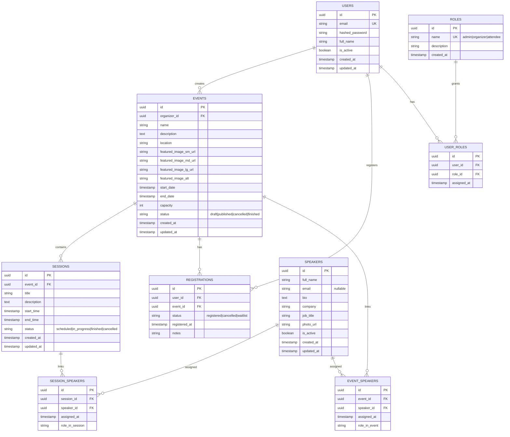

## Guía para desarrollar el proyecto "Prueba técnica Desarrollador Backend" para tusdatos.co

Este documento es mi guía personal para construir y entregar el MVP de **Mis Eventos**.  
Mi foco es una sola entrega funcional y sólida.

---
### Contexto del requerimiento

**Cliente:** Mis Eventos.  
**Problema real:** hoy manejan eventos de forma manual y eso les genera desorden, errores y pérdida de tiempo.

#### Soluciones propuestas para resolver el problema

- centralizar la gestión de eventos.
- permitir registro/login de usuarios.
- permitir inscripciones a eventos con control de cupos.
- organizar sesiones por evento.
- dar visibilidad clara al usuario sobre sus inscripciones.

---
## Alcance

### Funcionalidades a entregar

- autenticación JWT (`register`, `login`, `me`).
- CRUD completo de eventos.
- búsqueda por nombre y paginación de eventos.
- gestión de sesiones por evento.
- inscripción de usuarios a eventos.
- consulta de eventos inscritos por usuario.
- gestión de usuarios y roles desde perfil admin.
- validaciones críticas de negocio.
- Swagger/OpenAPI disponible.
- ejecución con Docker Compose.
- pruebas mínimas de backend.

---
### Flujos de usuario, permisos y componentes

Esta sección define la navegación, componentes compartidos y permisos por rol para el MVP.

#### Reglas globales

- Tipos de usuario: visitante (sin login), `attendee`, `organizer`, `admin`.
- El registro crea usuarios con rol por defecto `attendee`.
- La consulta de eventos y detalle es pública; la inscripción requiere autenticación.
- La inscripción solo se habilita si hay cupos disponibles y no existe inscripción previa del mismo usuario.
- Los ítems del menú lateral y las acciones visibles cambian según el rol (RBAC).

#### Componentes compartidos

1. Menú lateral:
   - Renderiza opciones de navegación según rol.
2. Inicio:
   - Botón `Ver todos los eventos` que redirige a `Eventos`.
   - Carrusel de los últimos 12 eventos.
   - El carrusel se pausa al pasar el cursor.
   - Cada tarjeta incluye botón `Ver detalles`.
3. Eventos:
   - Buscador por nombre o coincidencia parcial.
   - Filtro por fecha.
   - Grid de eventos con paginación.
   - Cada tarjeta incluye botón `Ver detalle`.
4. Detalle de evento:
   - Muestra: nombre, imagen destacada, texto alternativo, fecha, organizador, ubicación, descripción, capacidad y sesiones.
   - Sesiones con: horario, estado y ponentes asignados.
   - Botón `Volver a eventos`.
5. ¿Soy oferente?:
   - Buscador por nombre o coincidencia parcial.
   - Devuelve coincidencias donde el oferente esté agendado: evento, fecha y sesión.
   - Botón `Ver evento`.
6. Autenticación:
   - Formularios de `Iniciar sesión` y `Registrarme`.
   - Acción `Salir` para cerrar sesión.

#### Flujo por tipo de usuario

##### 1. Usuario visitante (sin autenticación)

- Menú lateral: `Inicio`, `Eventos`, `¿Soy oferente?`, `Acceder`.
- En `Inicio`: ve carrusel, botón `Ver todos los eventos` y botón `Iniciar sesión`.
- En `Eventos`: puede buscar, filtrar, paginar y abrir detalle.
- En `Detalle de evento`: ve botón para iniciar sesión y poder inscribirse.
- `Acceder` abre menú flotante con: `Iniciar sesión`, `Registrarme`, `¿Soy oferente?`.

##### 2. Usuario autenticado con rol `attendee`

- Menú lateral: `Inicio`, `Eventos`, `¿Soy oferente?`, `Mi perfil`, `Salir`.
- En `Inicio`: saludo personalizado, carrusel y acceso a eventos.
- En `Eventos` y `Detalle de evento`: puede consultar e inscribirse si hay capacidad.
- En `Mi perfil`:
  - Puede editar nombre y contraseña (validando contraseña actual).
  - Ve `Agenda de eventos` con sus eventos inscritos y acceso al detalle.
- `Salir` cierra la sesión.

##### 3. Usuario autenticado con rol `organizer`

- Menú lateral: `Inicio`, `Eventos`, `¿Soy oferente?`, `Crear evento`, `Mi perfil`, `Salir`.
- Hereda todas las capacidades de `attendee`.
- En `Crear evento`: puede crear eventos con nombre, fecha, ubicación, capacidad, estado, imagen destacada, texto alternativo y descripción.
- En `Eventos` y `Detalle de evento`:
  - Si es creador del evento: `Editar evento`, `Eliminar evento`, `Crear sesión`, `Ver sesión` y `Editar sesión`.
  - Si no es creador: mantiene acciones de consulta e inscripción según reglas.
- En `Mi perfil`:
  - Datos personales (nombre y contraseña).
  - `Eventos organizados por mí`.
  - `Agenda de eventos`.

##### 4. Usuario autenticado con rol `admin`

- Menú lateral: `Inicio`, `Eventos`, `¿Soy oferente?`, `Métricas`, `Crear evento`, `Mi perfil`, `Salir`.
- Hereda capacidades de `attendee` y `organizer`.
- Tiene control global sobre eventos y sesiones:
  - Crear, editar y eliminar cualquier evento.
  - Crear, ver y editar sesiones de cualquier evento.
- En `Métricas`: visualiza indicadores y resumen de datos relevantes de eventos.
- En `Mi perfil`:
  - Datos personales (nombre y contraseña).
  - `Eventos organizados por mí`.
  - `Agenda de eventos`.
  - `Gestión de usuarios`: lista de usuarios y cambio de rol.
  - `Todos los eventos`: listado global con filtros por nombre, fecha, estado, organizador y orden (alfabético/fecha).
- `Salir` cierra la sesión.

#### Matriz resumida de permisos

| Módulo / Acción | Visitante | `attendee` | `organizer` | `admin` |
|---|---|---|---|---|
| Ver inicio, eventos y detalle | Sí | Sí | Sí | Sí |
| Inscribirse a evento | No | Sí | Sí | Sí |
| Consultar `¿Soy oferente?` | Sí | Sí | Sí | Sí |
| Editar perfil (nombre/contraseña) | No | Sí | Sí | Sí |
| Crear evento | No | No | Sí | Sí |
| Editar/eliminar evento propio | No | No | Sí | Sí |
| Editar/eliminar cualquier evento | No | No | No | Sí |
| Gestionar sesiones | No | No | Solo en eventos propios | Sí |
| Ver métricas | No | No | No | Sí |
| Gestionar usuarios y roles | No | No | No | Sí |

---
## Reglas de negocio

- no permitir inscripciones por encima de la capacidad del evento.
- no permitir inscripción duplicada del mismo usuario al mismo evento.
- no permitir eventos con fechas inválidas.
- no permitir sesiones con horarios inválidos.
- no permitir sesiones fuera del rango del evento.
- no permitir cambiar un usuario a `attendee` si ya creó eventos.
- el admin principal configurado (`madebygarzon@gmail.com`) no puede perder rol `admin`.

---
## Variables de entorno reales (MVP)

Esta sección centraliza los valores reales que uso en desarrollo para los `.env`.

### Root (`/.env`)

Estas variables son referencia para base de datos local; en Docker Compose el servicio `db` ya define estos valores explícitamente.

| Variable | Valor real | Corresponde a |
|---|---|---|
| `POSTGRES_DB` | `mis_eventos` | Nombre de la base PostgreSQL |
| `POSTGRES_USER` | `postgres` | Usuario de PostgreSQL |
| `POSTGRES_PASSWORD` | `postgres` | Contraseña de PostgreSQL |
| `DATABASE_URL` | `postgresql+psycopg://postgres:postgres@db:5432/mis_eventos` | URL de conexión backend -> DB |

### Backend (`/backend/.env`)

| Variable | Valor real | Corresponde a |
|---|---|---|
| `APP_NAME` | `Mis Eventos API` | Nombre de la aplicación FastAPI |
| `API_V1_PREFIX` | `/api/v1` | Prefijo base de rutas API |
| `SECRET_KEY` | `replace_with_a_strong_random_secret` | Firma de JWT |
| `ALGORITHM` | `HS256` | Algoritmo JWT |
| `ACCESS_TOKEN_EXPIRE_MINUTES` | `60` | Minutos de vigencia del token |
| `DATABASE_URL` | `postgresql+psycopg://postgres:postgres@db:5432/mis_eventos` | Conexión a PostgreSQL |
| `BACKEND_CORS_ORIGINS` | `http://localhost:5173,http://127.0.0.1:5173` | Orígenes permitidos para frontend |
| `ADMIN_EMAIL` | `madebygarzon@gmail.com` | Usuario admin principal del sistema |

### Frontend (`/frontend/.env`)

| Variable | Valor real | Corresponde a |
|---|---|---|
| `VITE_API_BASE_URL` | `http://localhost:8000/api/v1` | URL base del backend consumida por el cliente React |

---
## Backlog de métricas (tareas a realizar)

Estas tareas describen los indicadores que debo implementar o fortalecer en el módulo de métricas del frontend/backend.

- [ ] Implementar métrica de total de eventos creados por período.
- [ ] Implementar métrica de eventos por estado (`draft`, `published`, `cancelled`, `finished`).
- [ ] Implementar tasa de publicación (`eventos publicados / eventos creados`).
- [ ] Implementar capacidad total vs cupos ocupados por evento.
- [ ] Implementar tasa de ocupación por evento (`inscritos / capacidad`).
- [ ] Implementar ranking de eventos con mayor número de inscripciones.
- [ ] Implementar métrica de velocidad de inscripción (tiempo hasta completar cupos).
- [ ] Implementar serie temporal de inscripciones por día/semana/mes.
- [ ] Implementar tasa de cancelación de inscripciones.
- [ ] Implementar no-show rate (`inscritos vs asistentes`) cuando exista registro de asistencia.
- [ ] Implementar promedio y distribución de sesiones por evento.
- [ ] Implementar sesiones por estado (`scheduled`, `in_progress`, `finished`, `cancelled`).
- [ ] Implementar promedio de ponentes por sesión.
- [ ] Implementar ranking de ponentes más activos (más sesiones asignadas).
- [ ] Implementar ranking de organizadores más activos (más eventos creados).
- [ ] Implementar conversión de detalle a inscripción (`vista detalle -> registro`), si se captura analítica de vistas.
- [ ] Implementar tiempo promedio entre creación del evento y fecha de inicio.
- [ ] Implementar alerta de eventos sin sesiones asociadas.
- [ ] Implementar alerta de eventos con baja ocupación (ejemplo: menor a 30%).
- [ ] Implementar retención de usuarios (`usuarios inscritos en más de un evento`).

---
### Modelo base de datos



> Nota de negocio vigente: el flujo activo usa ponentes por sesión (`session_speakers`).  
> La tabla `event_speakers` existe por evolución de esquema, pero la asociación global de ponentes a evento está deshabilitada en la lógica actual.

#### Reglas de integridad

- `users.email` único.
- `events.capacity > 0`.
- `events.organizer_id` referencia `users.id`.
- `sessions.event_id` referencia `events.id`.
- `registrations.user_id` referencia `users.id`.
- `registrations.event_id` referencia `events.id`.
- `events.start_date < events.end_date`.
- `sessions.start_time < sessions.end_time`.
- sesión dentro del rango del evento.
- `registrations` único por `(user_id, event_id)`.
- `session_speakers` único por `(session_id, speaker_id)`.
- `event_speakers` único por `(event_id, speaker_id)`.
- `roles.name` único.
- `user_roles` único por `(user_id, role_id)`.
- `speakers` no depende de `users` (ponente no necesita cuenta).
- en la lógica actual, al actualizar rol desde administración dejo un solo rol activo por usuario.

#### Índices

- `events(name)`.
- `events(status)`.
- `events(organizer_id)`.
- `sessions(event_id, start_time)`.
- `registrations(event_id)`.
- `registrations(user_id)`.
- `roles(name)`.
- `user_roles(user_id, role_id)` único.
- `speakers(full_name)`.
- `speakers(email)`.
- `session_speakers(session_id)`.
- `session_speakers(speaker_id)`.
- `event_speakers(event_id)`.
- `event_speakers(speaker_id)`.

---
### Arquitectura para esta entrega

Voy a construir un **monolito modular** porque me permite entregar rápido, con menos riesgo y con buena calidad. Priorizo entrega, mantenibilidad y criterio. 

#### Cómo lo voy a organizar

Módulos:

- `auth`
- `users`
- `events`
- `sessions`
- `speakers`
- `registrations`

Capas por módulo:

- `api` para HTTP.
- `service` para reglas de negocio.
- `repository` para acceso a datos.
- `models/schemas` para entidades y contratos.

Elegí un monolito modular porque el alcance de la prueba no justifica una arquitectura distribuida. Esta decisión me permite entregar más rápido, reducir complejidad operativa y mantener una base técnica limpia.
Lo estructuré por módulos de negocio como auth, users, events, sessions, speakers y registrations, lo que facilita la mantenibilidad y la evolución del sistema.
Dentro de cada módulo separé responsabilidades en capas: api para exposición HTTP, service para reglas de negocio, repository para persistencia y models/schemas para entidades y contratos.
Con esto logro un sistema simple de desplegar, fácil de probar y suficientemente escalable para el contexto de la prueba.

---
### Cómo aplicaré SOLID en la práctica

#### S — Responsabilidad única

- `api` solo coordina request/response.
- `service` concentra reglas de negocio.
- `repository` hace persistencia.

#### O — Abierto/cerrado

- extender comportamiento con nuevas clases/estrategias.
- evitar crecer lógica con `if/else` gigantes.

#### L — Sustitución

- cualquier implementación debe cumplir el mismo contrato esperado.

#### I — Segregación de interfaces

- interfaces pequeñas por caso de uso.
- separar lectura y escritura cuando tenga sentido.

#### D — Inversión de dependencias

- servicios dependen de abstracciones, no de implementaciones concretas.
- inyección de dependencias para facilitar pruebas.

#### Anti-patrones evitados

- controladores con lógica de negocio.
- servicios ejecutando SQL directo.
- repositorios ocultando reglas de negocio.
- acoplar lógica de dominio a detalles del framework.

---
## Stack a usar

### Backend

- FastAPI
- SQLModel
- PostgreSQL
- Alembic
- Poetry
- pytest

### Frontend

- React + Vite
- React Router
- Zustand
- Axios
- Vitest

### Infra

- Docker
- Docker Compose

---
## Checklist final de cumplimiento (requisito -> implementación)

### Backend técnico

- **Python 3.12** -> `python:3.12` en Dockerfile backend.
- **FastAPI o Flask** -> FastAPI.
- **SQLAlchemy + SQLModel (o Core)** -> SQLModel sobre SQLAlchemy.
- **PostgreSQL** -> servicio `db` en Docker Compose.
- **Poetry** -> gestión de dependencias backend.
- **Alembic** -> versionado y ejecución de migraciones.
- **Tests unitarios (pytest)** -> suite mínima para auth/eventos/sesiones/inscripciones/usuarios.
- **Swagger/OpenAPI** -> documentación automática de FastAPI.

### Frontend técnico

- **React, Vue o Angular** -> React.
- **Router** -> React Router.
- **Manejador de estado** -> Zustand.
- **Peticiones HTTP** -> Axios.
- **Tests unitarios** -> Vitest.

### Entorno

- **Docker + Docker Compose** -> servicios backend/frontend/db.
- **Variables de entorno** -> `.env` y `.env.example` por servicio.

### Optimización y calidad

- **Optimización de imágenes** -> WebP + compresión + variantes por tamaño (desktop/tablet/mobile).
- **Lazy loading** -> `React.lazy` + `Suspense` + carga diferida de rutas principales.
- **Minificación de código** -> build de producción con Vite (minify activo).
- **Caching** -> cache en frontend para consultas frecuentes o Redis en backend (si incluyo capa adicional).
- **Linting** -> ESLint (frontend) + Ruff/Black (backend).
- **Testing** -> pytest (backend) + Vitest (frontend).

### UI/UX mínimo a cumplir

- diseño limpio, usable y consistente.
- responsive en móvil/tablet/desktop.
- loading states (spinner/skeleton) en vistas con carga.
- feedback visual para acciones: éxito/error/validación.

---
## API a construir

### Auth

- `POST /api/v1/auth/register`
- `POST /api/v1/auth/login`
- `GET /api/v1/auth/me`

### Events

- `GET /api/v1/events`
- `GET /api/v1/events/{id}`
- `POST /api/v1/events`
- `PUT /api/v1/events/{id}`
- `DELETE /api/v1/events/{id}`

Filtros:

- `search`
- `page`
- `limit`
- `status`

### Sessions

- `GET /api/v1/events/{event_id}/sessions`
- `POST /api/v1/events/{event_id}/sessions`
- `PUT /api/v1/sessions/{id}`
- `DELETE /api/v1/sessions/{id}`

### Registrations

- `POST /api/v1/events/{event_id}/register`
- `GET /api/v1/users/me/registrations`
- `DELETE /api/v1/events/{event_id}/register`

### Users (admin)

- `GET /api/v1/users`
- `PATCH /api/v1/users/{user_id}/role`

---
## Estructura del repositorio a seguir

```txt
misEventos/
├── backend/
│   ├── app/
│   │   ├── api/
│   │   │   └── v1/
│   │   ├── core/
│   │   ├── models/
│   │   ├── schemas/
│   │   ├── services/
│   │   ├── repositories/
│   │   ├── tests/
│   │   └── main.py
│   ├── alembic/
│   ├── pyproject.toml
│   ├── Dockerfile
│   └── README.md
├── frontend/
│   ├── src/
│   │   ├── api/
│   │   ├── components/
│   │   ├── features/
│   │   ├── pages/
│   │   ├── router/
│   │   ├── store/
│   │   └── utils/
│   ├── Dockerfile
│   └── README.md
├── docker-compose.yml
├── .env.example
└── README.md
```

---
## Frontend mínimo

### Páginas

- `/` listado.
- `/events/:id` detalle.
- `/events/create` crear.
- `/events/:id/edit` editar.
- `/login`
- `/register`
- `/profile`
- `/profile` incluye gestión de usuarios (solo admin).

### Componentes base

- `EventCard`
- `EventForm`
- `SessionList`
- `SessionForm`
- `Pagination`
- `Navbar`
- `ProtectedRoute`

### Estado global mínimo

`auth store`:
- user, token, isAuthenticated, login/logout/register.

`events store`:
- events, currentEvent, loading, pagination, fetch/create/update.

---
## Validaciones y seguridad mínimas

### Validaciones backend

- email único.
- password mínima.
- capacidad positiva.
- fechas y horarios válidos.
- no duplicar inscripción.
- bloquear inscripción cuando no hay cupo.

### Seguridad

- hashing de contraseña.
- JWT para autenticación.
- rutas protegidas en backend.
- guardas de ruta en frontend.
- RBAC por rol (`admin`, `organizer`, `attendee`) aplicado por endpoint.
- `admin` con permisos globales; `organizer` con gestión de eventos/sesiones; `attendee` con inscripción/cancelación.

---
## Plan de implementación (ruta de trabajo)

### Fase 1: base técnica

- estructura backend/frontend.
- DB + Alembic.
- Docker Compose.

### Fase 2: backend core

- auth.
- eventos (CRUD + búsqueda + paginación).

### Fase 3: backend negocio

- sesiones.
- inscripciones.
- validaciones críticas.

### Fase 4: frontend core

- auth frontend.
- listado/detalle/create/edit de eventos.
- perfil de inscripciones.

### Fase 5: cierre

- pruebas mínimas.
- documentación.
- revisión final de errores.

---
## Definition of Done (DoD)

Considero una parte terminada cuando:

- cumple su criterio funcional.
- tiene validaciones de negocio aplicadas.
- tiene pruebas mínimas pasando.
- está documentada.
- maneja errores de forma consistente.

---
### Cierre

Mi objetivo es entregar un MVP sólido, coherente y profesional, sin meter complejidad que no aporte a esta prueba tecnica.
