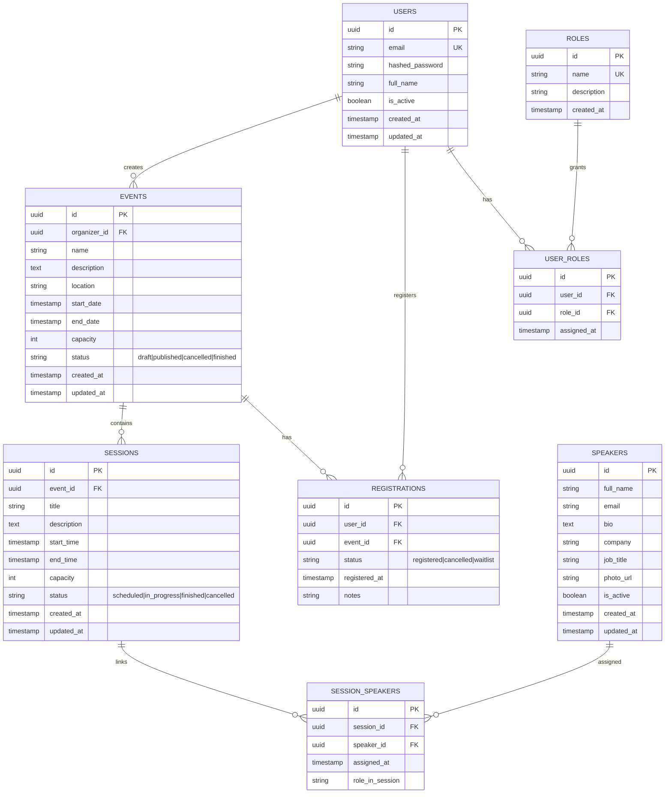

## Guía de proyecto (MVP)

Este documento es mi guía personal para construir y entregar el MVP de **Mis Eventos**.  
Mi foco es una sola entrega funcional y sólida.

---
### Contexto del requerimiento

**Cliente:** Mis Eventos.  
**Problema real:** hoy manejan eventos de forma manual y eso les genera desorden, errores y pérdida de tiempo.

#### Soluciones propuestas para resolver el problema

- centralizar la gestión de eventos.
- permitir registro/login de usuarios.
- permitir inscripciones a eventos con control de cupos.
- organizar sesiones por evento.
- dar visibilidad clara al usuario sobre sus inscripciones.

---
## Alcance

### Funcionalidades a entregar

- autenticación JWT (`register`, `login`, `me`).
- CRUD completo de eventos.
- búsqueda por nombre y paginación de eventos.
- gestión de sesiones por evento.
- inscripción de usuarios a eventos.
- consulta de eventos inscritos por usuario.
- validaciones críticas de negocio.
- Swagger/OpenAPI disponible.
- ejecución con Docker Compose.
- pruebas mínimas de backend.

---
### Flujo crítico de usuarios a implementar

#### 1. Visitante no autenticado

Un visitante entra, ve el listado, busca eventos y revisa detalles.  
Si quiere hacer acciones privadas (como inscribirse), lo llevo a login/registro.

#### 2. Asistente autenticado

El usuario se registra o inicia sesión, revisa eventos, se inscribe si hay cupo y luego puede ver sus eventos inscritos desde su perfil.

#### 3. Organizador

El organizador crea/edita/elimina eventos, define fechas, capacidad y estado.  
También crea sesiones, ajusta horarios y asigna ponentes.

#### 4. Administrador

En esta entrega lo tomo como visión funcional de supervisión, sin implementar un RBAC completo.  
Me sirve para mantener claro el modelo sin sobrecargar el alcance.

---
## Reglas de negocio

- no permitir inscripciones por encima de la capacidad del evento.
- no permitir inscripción duplicada del mismo usuario al mismo evento.
- no permitir eventos con fechas inválidas.
- no permitir sesiones con horarios inválidos.
- no permitir sesiones fuera del rango del evento.

---
### Modelo base de datos



#### Reglas de integridad

- `users.email` único.
- `events.capacity > 0`.
- `sessions.capacity > 0`.
- `events.start_date < events.end_date`.
- `sessions.start_time < sessions.end_time`.
- sesión dentro del rango del evento.
- `registrations` único por `(user_id, event_id)`.
- `session_speakers` único por `(session_id, speaker_id)`.
- `roles.name` único.
- `user_roles` único por `(user_id, role_id)`.

#### Índices

- `events(name)`.
- `events(status)`.
- `sessions(event_id, start_time)`.
- `registrations(event_id)`.
- `registrations(user_id)`.

---
### Arquitectura para esta entrega

Voy a construir un **monolito modular** porque me permite entregar rápido, con menos riesgo y con buena calidad. Priorizo entrega, mantenibilidad y criterio. 

#### Cómo lo voy a organizar

Módulos:

- `auth`
- `users`
- `events`
- `sessions`
- `speakers`
- `registrations`

Capas por módulo:

- `api` para HTTP.
- `service` para reglas de negocio.
- `repository` para acceso a datos.
- `models/schemas` para entidades y contratos.

Elegí un monolito modular porque el alcance de la prueba no justifica una arquitectura distribuida. Esta decisión me permite entregar más rápido, reducir complejidad operativa y mantener una base técnica limpia.
Lo estructuré por módulos de negocio como auth, users, events, sessions, speakers y registrations, lo que facilita la mantenibilidad y la evolución del sistema.
Dentro de cada módulo separé responsabilidades en capas: api para exposición HTTP, service para reglas de negocio, repository para persistencia y models/schemas para entidades y contratos.
Con esto logro un sistema simple de desplegar, fácil de probar y suficientemente escalable para el contexto de la prueba.

---
### Cómo aplicaré SOLID en la práctica

#### S — Responsabilidad única

- `api` solo coordina request/response.
- `service` concentra reglas de negocio.
- `repository` hace persistencia.

#### O — Abierto/cerrado

- extender comportamiento con nuevas clases/estrategias.
- evitar crecer lógica con `if/else` gigantes.

#### L — Sustitución

- cualquier implementación debe cumplir el mismo contrato esperado.

#### I — Segregación de interfaces

- interfaces pequeñas por caso de uso.
- separar lectura y escritura cuando tenga sentido.

#### D — Inversión de dependencias

- servicios dependen de abstracciones, no de implementaciones concretas.
- inyección de dependencias para facilitar pruebas.

#### Anti-patrones evitados

- controladores con lógica de negocio.
- servicios ejecutando SQL directo.
- repositorios ocultando reglas de negocio.
- acoplar lógica de dominio a detalles del framework.

---
## Stack a usar

### Backend

- FastAPI
- SQLModel
- PostgreSQL
- Alembic
- Poetry
- pytest

### Frontend

- React + Vite
- React Router
- Zustand
- Axios
- Vitest

### Infra

- Docker
- Docker Compose

---
## Checklist final de cumplimiento (requisito -> implementación)

### Backend técnico

- **Python 3.12** -> `python:3.12` en Dockerfile backend.
- **FastAPI o Flask** -> FastAPI.
- **SQLAlchemy + SQLModel (o Core)** -> SQLModel sobre SQLAlchemy.
- **PostgreSQL** -> servicio `db` en Docker Compose.
- **Poetry** -> gestión de dependencias backend.
- **Alembic** -> versionado y ejecución de migraciones.
- **Tests unitarios (pytest)** -> suite mínima para auth/eventos/inscripciones.
- **Swagger/OpenAPI** -> documentación automática de FastAPI.

### Frontend técnico

- **React, Vue o Angular** -> React.
- **Router** -> React Router.
- **Manejador de estado** -> Zustand.
- **Peticiones HTTP** -> Axios.
- **Tests unitarios** -> Vitest.

### Entorno

- **Docker + Docker Compose** -> servicios backend/frontend/db.
- **Variables de entorno** -> `.env` y `.env.example` por servicio.

### Optimización y calidad

- **Optimización de imágenes** -> WebP + compresión + variantes por tamaño (desktop/tablet/mobile).
- **Lazy loading** -> `React.lazy` + `Suspense` + carga diferida de rutas principales.
- **Minificación de código** -> build de producción con Vite (minify activo).
- **Caching** -> cache en frontend para consultas frecuentes o Redis en backend (si incluyo capa adicional).
- **Linting** -> ESLint (frontend) + Ruff/Black (backend).
- **Testing** -> pytest (backend) + Vitest (frontend).

### UI/UX mínimo a cumplir

- diseño limpio, usable y consistente.
- responsive en móvil/tablet/desktop.
- loading states (spinner/skeleton) en vistas con carga.
- feedback visual para acciones: éxito/error/validación.

---
## API a construir

### Auth

- `POST /api/v1/auth/register`
- `POST /api/v1/auth/login`
- `GET /api/v1/auth/me`

### Events

- `GET /api/v1/events`
- `GET /api/v1/events/{id}`
- `POST /api/v1/events`
- `PUT /api/v1/events/{id}`
- `DELETE /api/v1/events/{id}`

Filtros:

- `search`
- `page`
- `limit`
- `status`

### Sessions

- `GET /api/v1/events/{event_id}/sessions`
- `POST /api/v1/events/{event_id}/sessions`
- `PUT /api/v1/sessions/{id}`
- `DELETE /api/v1/sessions/{id}`

### Registrations

- `POST /api/v1/events/{event_id}/register`
- `GET /api/v1/users/me/registrations`
- `DELETE /api/v1/events/{event_id}/register` (si alcanzo en tiempo)

---
## Estructura del repositorio a seguir

```txt
misEventos/
├── backend/
│   ├── app/
│   │   ├── api/
│   │   │   └── v1/
│   │   ├── core/
│   │   ├── models/
│   │   ├── schemas/
│   │   ├── services/
│   │   ├── repositories/
│   │   ├── tests/
│   │   └── main.py
│   ├── alembic/
│   ├── pyproject.toml
│   ├── Dockerfile
│   └── README.md
├── frontend/
│   ├── src/
│   │   ├── api/
│   │   ├── components/
│   │   ├── features/
│   │   ├── pages/
│   │   ├── router/
│   │   ├── store/
│   │   └── utils/
│   ├── Dockerfile
│   └── README.md
├── docker-compose.yml
├── .env.example
└── README.md
```

---
## Frontend mínimo

### Páginas

- `/` listado.
- `/events/:id` detalle.
- `/events/create` crear.
- `/events/:id/edit` editar.
- `/login`
- `/register`
- `/profile`

### Componentes base

- `EventCard`
- `EventForm`
- `SessionList`
- `SessionForm`
- `Pagination`
- `Navbar`
- `ProtectedRoute`

### Estado global mínimo

`auth store`:
- user, token, isAuthenticated, login/logout/register.

`events store`:
- events, currentEvent, loading, pagination, fetch/create/update.

---
## Validaciones y seguridad mínimas

### Validaciones backend

- email único.
- password mínima.
- capacidad positiva.
- fechas y horarios válidos.
- no duplicar inscripción.
- bloquear inscripción cuando no hay cupo.

### Seguridad

- hashing de contraseña.
- JWT para autenticación.
- rutas protegidas en backend.
- guardas de ruta en frontend.

---
## Plan de implementación (ruta de trabajo)

### Fase 1: base técnica

- estructura backend/frontend.
- DB + Alembic.
- Docker Compose.

### Fase 2: backend core

- auth.
- eventos (CRUD + búsqueda + paginación).

### Fase 3: backend negocio

- sesiones.
- inscripciones.
- validaciones críticas.

### Fase 4: frontend core

- auth frontend.
- listado/detalle/create/edit de eventos.
- perfil de inscripciones.

### Fase 5: cierre

- pruebas mínimas.
- documentación.
- revisión final de errores.

---
## Definition of Done (DoD)

Considero una parte terminada cuando:

- cumple su criterio funcional.
- tiene validaciones de negocio aplicadas.
- tiene pruebas mínimas pasando.
- está documentada.
- maneja errores de forma consistente.

---
### Cierre

Mi objetivo es entregar un MVP sólido, coherente y profesional, sin meter complejidad que no aporte a esta prueba tecnica.
